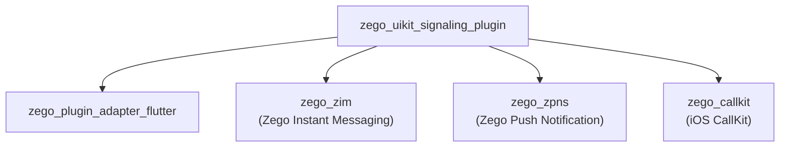
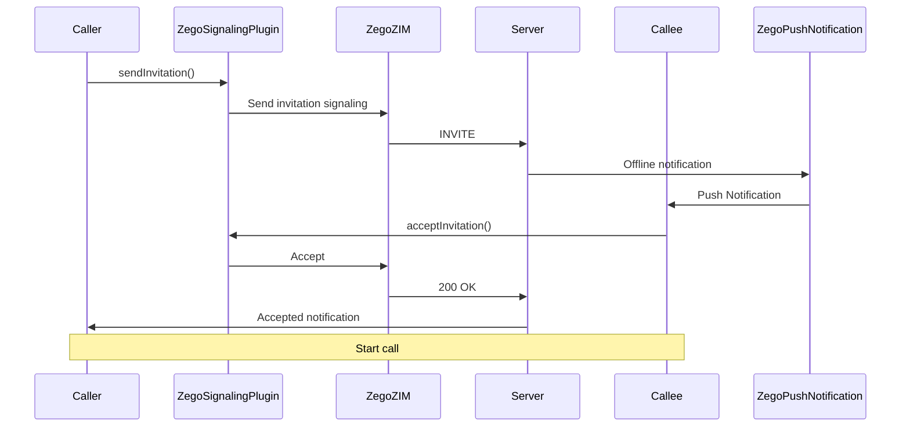
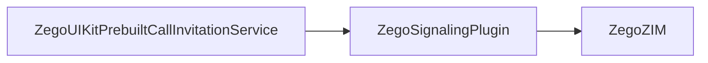

# ZegoUIKitSignalingPlugin Architecture

> Signaling plugin - implements ZegoSignalingPluginInterface

## Overview

`zego_uikit_signaling_plugin_flutter` is the **signaling plugin implementation** that implements `ZegoSignalingPluginInterface` defined in `ZegoPluginAdapter`:

- Call invitation signaling
- Offline push notifications (ZPNs)
- CallKit adapter (iOS)
- Background message handling
- Real-time messaging

**Depends on**: `zego_plugin_adapter_flutter` (interface definition)

## Package Relationship



## Core Class: ZegoSignalingPlugin

Main entry singleton, located at `lib/zego_uikit_signaling_plugin.dart`:

```dart
class ZegoSignalingPlugin implements ZegoSignalingPluginInterface {
  factory ZegoSignalingPlugin() => instance;

  /// Get plugin type
  @override
  ZegoUIKitPluginType getPluginType() => ZegoUIKitPluginType.signaling;
}
```

## Quick Start

### 1. Install Plugin

```dart
// On app startup
ZegoPluginAdapterImpl().installPlugins([
  ZegoSignalingPlugin(),
]);
```

### 2. Initialize

```dart
await ZegoUIKitSignalingPlugin().init(
  appID: yourAppID,
  appSign: yourAppSign,
  userID: userID,
  userName: userName,
  config: ZegoSignalingConfig(
    offlinePushConfig: ZegoSignalingOfflinePushConfig(
      enabled: true,
      // iOS APNs / Android FCM config
    ),
  ),
);
```

### 3. Send Invitation

```dart
final invitationID = await ZegoUIKitSignalingPlugin().sendInvitation(
  inviterID: currentUserID,
  inviteeID: targetUserID,
  customData: '{"callType": "video"}',
  timeout: 60,
);

print('Invitation sent: $invitationID');
```

### 4. Handle Invitation Events

```dart
// Listen for incoming invitation
ZegoUIKitSignalingPlugin().onInvitationReceived.listen((event) {
  print('${event.callerName} is calling...');
  // Show incoming call UI
});

// Listen for invitation accepted
ZegoUIKitSignalingPlugin().onInvitationAccepted.listen((event) {
  print('${event.calleeName} accepted');
});

// Listen for invitation rejected
ZegoUIKitSignalingPlugin().onInvitationRejected.listen((event) {
  print('${event.calleeName} rejected');
});
```

## Invitation Flow



## Events

```dart
// Incoming invitation (receiver)
.onInvitationReceived.listen((ZegoSignalingInvitationReceivedEvent event) {
  // Show incoming call UI
  showIncomingCallUI(
    callerName: event.callerName,
    callType: event.customData,
  );
});

// Invitation accepted (sender)
.onInvitationAccepted.listen((ZegoSignalingInvitationAcceptedEvent event) {
  // Start call
});

// Invitation rejected (sender)
.onInvitationRejected.listen((ZegoSignalingInvitationRejectedEvent event) {
  // Show rejected by other party
});

// Invitation cancelled (sender)
.onInvitationCancelled.listen((ZegoSignalingInvitationCancelledEvent event) {
  // Other party cancelled
});

// Invitation timeout (sender)
.onInvitationTimeout.listen((ZegoSignalingInvitationTimeoutEvent event) {
  // No response timeout
});

// Offline invitation (on cold start)
.onOfflineInvitationReceived.listen((event) {
  // Handle offline invitation
});
```

## CallKit Adapter (iOS)

iOS platform uses CallKit for system-level calls:

```dart
// lib/src/callkit_adapter/

// Event converter - SDK events → CallKit events
class CallKitEventConverter {
  void onInviteReceived → CXCallUpdate
  void onInviteAccepted → CXStartCallAction
  void onInviteDeclined → CXEndCallAction
}

// Action manager - handle actions from system
class CallKitActionManager {
  // Handle outgoing
  Future<void> handleOutgoingCallAction(CXStartCallAction action);

  // Handle incoming answer
  Future<void> handleIncomingAnswerAction(CXAnswerCallAction action);

  // Handle reject
  Future<void> handleRejectAction(CXEndCallAction action);

  // Handle hang up
  Future<void> handleEndCallAction(CXEndCallAction action);
}
```

## Offline Push Notification (ZPNs)

### Android Config

```dart
ZegoSignalingOfflinePushConfig(
  enabled: true,
  channelID: 'zego_call',
  channelName: 'Call Notifications',
  sound: 'call.mp3',
  vibrate: true,
)
```

### iOS Config

```dart
ZegoSignalingOfflinePushConfig(
  enabled: true,
  apnsCertificatePath: 'path/to/cert.pem',
  apnsTopic: 'com.yourapp.voip',
)
```

## Directory Structure

```
lib/
└── zego_uikit_signaling_plugin.dart    # Main entry

lib/src/
├── signaling.dart              # Main entry
├── message.dart               # Message related
├── notification.dart           # Notification
├── room.dart                  # Room
├── user.dart                  # User
├── invitation.dart            # Invitation API
├── callkit_adapter/          # CallKit adapter
│   ├── index.dart
│   ├── action_manager.dart
│   ├── action_types.dart
│   └── event_converter.dart
├── background_message/        # Background message
│   └── ...
├── channel/                  # Platform channel
├── internal/                 # Internal core
│   ├── event_center.dart     # Event center
│   ├── core.dart             # Singleton core
│   └── extensions/
├── log/                      # Logging
└── services/
```

## Event Center

Event routing center:

```dart
class ZegoSignalingPluginEventCenter {
  /// ZIM events → Dart Stream
  void onZIMEvent(String eventType, Map<String, dynamic> data);

  /// ZPNs events → Dart Stream
  void onZPNsEvent(String eventType, Map<String, dynamic> data);

  /// Register event handler
  void registerEventHandler(String key, Handler handler);

  /// Unregister event handler
  void unregisterEventHandler(String key);
}
```

## Key Dependencies

| Package | Version | Purpose |
|---------|---------|---------|
| `zego_zim` | ^2.21.1+1 | Zego Instant Messaging |
| `zego_zpns` | ^2.8.0 | Zego Push Notification Service |
| `zego_callkit` | ^1.0.0+4 | iOS CallKit integration |
| `zego_plugin_adapter` | ^2.14.2 | Plugin interface |

## Common Issues

### 1. iOS CallKit Not Responding

Check App Groups configuration:
```xml
<!-- ios/Runner/Info.plist -->
<key>UIBackgroundModes</key>
<array>
    <string>voip</string>
</array>
```

### 2. Offline Notifications Not Received

Check ZPNs configuration:
- Android: Firebase configuration
- iOS: APNs certificate

### 3. Invitation Timeout

Default timeout is 60 seconds, adjustable via `timeout` parameter:

```dart
await sendInvitation(
  inviterID: userID,
  inviteeID: targetID,
  customData: '{}',
  timeout: 120,  // 120 seconds
);
```

## Integration with PrebuiltCall

PrebuiltCall uses this plugin for call invitations:



```dart
// Internal PrebuiltCall call
await ZegoPluginAdapterImpl().signalingPlugin.sendInvitation(
  inviterID: userID,
  inviteeID: inviteeID,
  customData: jsonEncode({
    'callType': callType,
    'callID': callID,
  }),
);
```

## Related Documentation

- [ZegoPluginAdapter Architecture](../zego_plugin_adapter_flutter/ARCHITECTURE.md)
- [ZegoUIKitPrebuiltCall Architecture](../zego_uikit_prebuilt_call_flutter/ARCHITECTURE.md)
