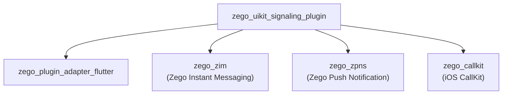
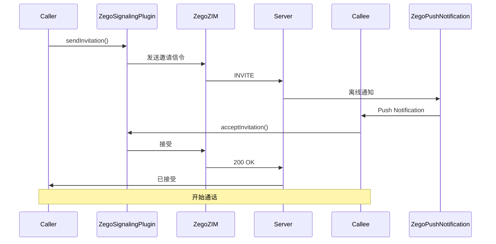
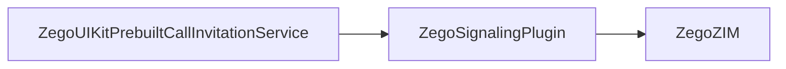

# ZegoUIKitSignalingPlugin Architecture

> 信令插件 - 实现 ZegoSignalingPluginInterface

## Overview

`zego_uikit_signaling_plugin_flutter` 是**信令插件实现**，实现了 `ZegoPluginAdapter` 中定义的 `ZegoSignalingPluginInterface`：

- 通话邀请信令
- 离线消息通知 (ZPNs)
- CallKit 适配 (iOS)
- 背景消息处理
- 实时消息

**依赖**: `zego_plugin_adapter_flutter` (定义接口)

## Package Relationship



## Core Class: ZegoSignalingPlugin

主入口单例，位于 `lib/zego_uikit_signaling_plugin.dart`：

```dart
class ZegoSignalingPlugin implements ZegoSignalingPluginInterface {
  factory ZegoSignalingPlugin() => instance;

  /// 获取插件类型
  @override
  ZegoUIKitPluginType getPluginType() => ZegoUIKitPluginType.signaling;
}
```

## Quick Start

### 1. 安装插件

```dart
// 在应用启动时
ZegoPluginAdapterImpl().installPlugins([
  ZegoSignalingPlugin(),
]);
```

### 2. 初始化

```dart
await ZegoUIKitSignalingPlugin().init(
  appID: yourAppID,
  appSign: yourAppSign,
  userID: userID,
  userName: userName,
  config: ZegoSignalingConfig(
    offlinePushConfig: ZegoSignalingOfflinePushConfig(
      enabled: true,
      // iOS APNs / Android FCM 配置
    ),
  ),
);
```

### 3. 发送邀请

```dart
final invitationID = await ZegoUIKitSignalingPlugin().sendInvitation(
  inviterID: currentUserID,
  inviteeID: targetUserID,
  customData: '{"callType": "video"}',
  timeout: 60,
);

print('Invitation sent: $invitationID');
```

### 4. 处理邀请事件

```dart
// 监听收到的邀请
ZegoUIKitSignalingPlugin().onInvitationReceived.listen((event) {
  print('${event.callerName} is calling...');
  // 显示来电界面
});

// 监听邀请被接受
ZegoUIKitSignalingPlugin().onInvitationAccepted.listen((event) {
  print('${event.calleeName} accepted');
});

// 监听邀请被拒绝
ZegoUIKitSignalingPlugin().onInvitationRejected.listen((event) {
  print('${event.calleeName} rejected');
});
```

## Invitation Flow



## Events

```dart
// 收到邀请（接收方）
.onInvitationReceived.listen((ZegoSignalingInvitationReceivedEvent event) {
  // 显示来电界面
  showIncomingCallUI(
    callerName: event.callerName,
    callType: event.customData,
  );
});

// 收到邀请被接受（发送方）
.onInvitationAccepted.listen((ZegoSignalingInvitationAcceptedEvent event) {
  // 开始通话
});

// 收到邀请被拒绝（发送方）
.onInvitationRejected.listen((ZegoSignalingInvitationRejectedEvent event) {
  // 显示对方拒绝
});

// 收到邀请被取消（发送方）
.onInvitationCancelled.listen((ZegoSignalingInvitationCancelledEvent event) {
  // 对方取消
});

// 邀请超时（发送方）
.onInvitationTimeout.listen((ZegoSignalingInvitationTimeoutEvent event) {
  // 无响应超时
});

// 离线邀请（应用冷启动时）
.onOfflineInvitationReceived.listen((event) {
  // 处理离线邀请
});
```

## CallKit Adapter (iOS)

iOS 平台使用 CallKit 处理系统级通话：

```dart
// lib/src/callkit_adapter/

// 事件转换器 - SDK 事件 → CallKit 事件
class CallKitEventConverter {
  void onInviteReceived → CXCallUpdate
  void onInviteAccepted → CXStartCallAction
  void onInviteDeclined → CXEndCallAction
}

// Action 管理器 - 处理来自系统的 Action
class CallKitActionManager {
  // 处理呼出
  Future<void> handleOutgoingCallAction(CXStartCallAction action);

  // 处理接听
  Future<void> handleIncomingAnswerAction(CXAnswerCallAction action);

  // 处理拒绝
  Future<void> handleRejectAction(CXEndCallAction action);

  // 处理挂断
  Future<void> handleEndCallAction(CXEndCallAction action);
}
```

## Offline Push Notification (ZPNs)

### Android 配置

```dart
ZegoSignalingOfflinePushConfig(
  enabled: true,
  channelID: 'zego_call',
  channelName: 'Call Notifications',
  sound: 'call.mp3',
  vibrate: true,
)
```

### iOS 配置

```dart
ZegoSignalingOfflinePushConfig(
  enabled: true,
  apnsCertificatePath: 'path/to/cert.pem',
  apnsTopic: 'com.yourapp.voip',
)
```

## Directory Structure

```
lib/
└── zego_uikit_signaling_plugin.dart    # 主入口

lib/src/
├── signaling.dart              # 主入口
├── message.dart               # 消息相关
├── notification.dart          # 通知
├── room.dart                  # 房间
├── user.dart                  # 用户
├── invitation.dart           # 邀请 API
├── callkit_adapter/          # CallKit 适配
│   ├── index.dart
│   ├── action_manager.dart
│   ├── action_types.dart
│   └── event_converter.dart
├── background_message/       # 背景消息
│   └── ...
├── channel/                  # 平台通道
├── internal/                 # 内部核心
│   ├── event_center.dart     # 事件中心
│   ├── core.dart             # 单例核心
│   └── extensions/
├── log/                     # 日志
└── services/
```

## Event Center

事件路由中心：

```dart
class ZegoSignalingPluginEventCenter {
  /// ZIM 事件 → Dart Stream
  void onZIMEvent(String eventType, Map<String, dynamic> data);

  /// ZPNs 事件 → Dart Stream
  void onZPNsEvent(String eventType, Map<String, dynamic> data);

  /// 注册事件监听
  void registerEventHandler(String key, Handler handler);

  /// 移除事件监听
  void unregisterEventHandler(String key);
}
```

## Key Dependencies

| Package | Version | Purpose |
|---------|---------|---------|
| `zego_zim` | ^2.21.1+1 | Zego 即时通讯 |
| `zego_zpns` | ^2.8.0 | Zego 推送通知服务 |
| `zego_callkit` | ^1.0.0+4 | iOS CallKit 集成 |
| `zego_plugin_adapter` | ^2.14.2 | 插件接口 |

## Common Issues

### 1. iOS CallKit 无反应

检查 App Groups 配置：
```xml
<!-- ios/Runner/Info.plist -->
<key>UIBackgroundModes</key>
<array>
    <string>voip</string>
</array>
```

### 2. 离线通知收不到

检查 ZPNs 配置是否正确：
- Android: Firebase 配置
- iOS: APNs 证书

### 3. 邀请超时

默认超时 60 秒，可通过 `timeout` 参数调整：

```dart
await sendInvitation(
  inviterID: userID,
  inviteeID: targetID,
  customData: '{}',
  timeout: 120,  // 120 秒
);
```

## Integration with PrebuiltCall

PrebuiltCall 通过此插件实现通话邀请：



```dart
// PrebuiltCall 内部调用
await ZegoPluginAdapterImpl().signalingPlugin.sendInvitation(
  inviterID: userID,
  inviteeID: inviteeID,
  customData: jsonEncode({
    'callType': callType,
    'callID': callID,
  }),
);
```

## Related Documentation

- [ZegoPluginAdapter Architecture](../zego_plugin_adapter_flutter/ARCHITECTURE.md)
- [ZegoUIKitPrebuiltCall Architecture](../zego_uikit_prebuilt_call_flutter/ARCHITECTURE.md)